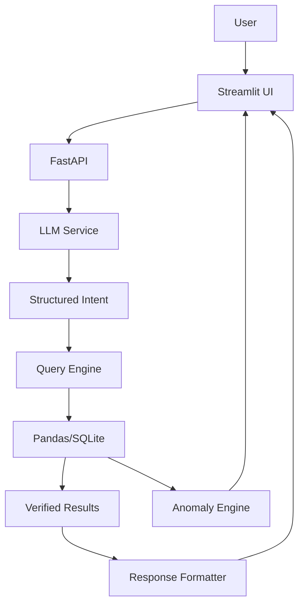

# AI Support Ticket Analytics Platform

## 1. Project Overview
An AI-powered customer support analytics application that transforms natural-language questions into structured intents, executes analytical queries on support ticket data, and presents the results naturally. It also features rule-based and statistical anomaly detection.

## 2. Architecture


## 3. Features
- Natural language to structured query extraction using local LLMs.
- Deterministic data querying via Pandas/SQLite to prevent hallucinations.
- Rule-based anomaly detection (slow resolutions, low ratings).
- Statistical anomaly detection (outliers in resolution times).
- Modern Streamlit dashboard.

## 4. Technology Stack
- **Backend**: Python 3.10+, FastAPI, Uvicorn, Pydantic
- **Data**: Pandas, SQLite
- **LLM**: Ollama (fallback to Mock)
- **Frontend**: Streamlit
- **Testing**: Pytest

## 5. Dataset
- `ticket_id`, `created_at`, `category`, `priority`, `status`, `response_time_hrs`, `resolution_time_hrs`, `agent_id`, `customer_rating`, `issue_summary`

## 6. Installation
```bash
python -m venv venv
source venv/bin/activate  # On Windows: venv\Scripts\activate
pip install -r requirements.txt
cp .env.example .env
```

## 7. Ollama Setup
1. Install Ollama from [ollama.com](https://ollama.com).
2. Run `ollama run llama3.2` to download and start the model.
3. Ensure `.env` has `LLM_PROVIDER=ollama`.

## 8. Running Backend
```bash
uvicorn app.main:app --reload
```

## 9. Running UI
```bash
streamlit run ui/streamlit_app.py
```

## 10. API Documentation
Available at `http://localhost:8000/docs`

## 11. Example Questions
1. How many critical tickets are unresolved?
2. What is the average resolution time for technical tickets?
3. Which agent has the lowest customer rating?
4. Show me all escalated billing tickets.
5. What percentage of tickets are resolved?
6. Which category has the highest average resolution time?
7. How many high-priority tickets were created?
8. Find critical tickets that took more than 12 hours to resolve.

## 12. Anomaly Detection
Combines business rules (e.g. priority=Critical AND status!=Resolved) with statistical methods (mean + 2*std on numeric fields).

## 13. Testing
```bash
pytest
```

## 14. Docker
```bash
docker-compose up --build
```
Note: LLM defaults to `mock` in docker-compose. To use host Ollama, configure host networking.

## 15. Architecture Decisions
- **FastAPI**: Fast, async, built-in validation.
- **Streamlit**: Rapid internal tool development.
- **Pandas**: Excellent for analytical aggregations.
- **Structured LLM Output**: Prevents arbitrary SQL injection and ensures the LLM is only doing reasoning, not math.

## 16. Limitations
- Small dataset optimized for Pandas memory loading.
- Local LLMs may struggle with complex zero-shot intent parsing without fine-tuning.

## 17. Future Improvements
- Vector DB for semantic searching of `issue_summary`.
- Advanced charting in Streamlit.
